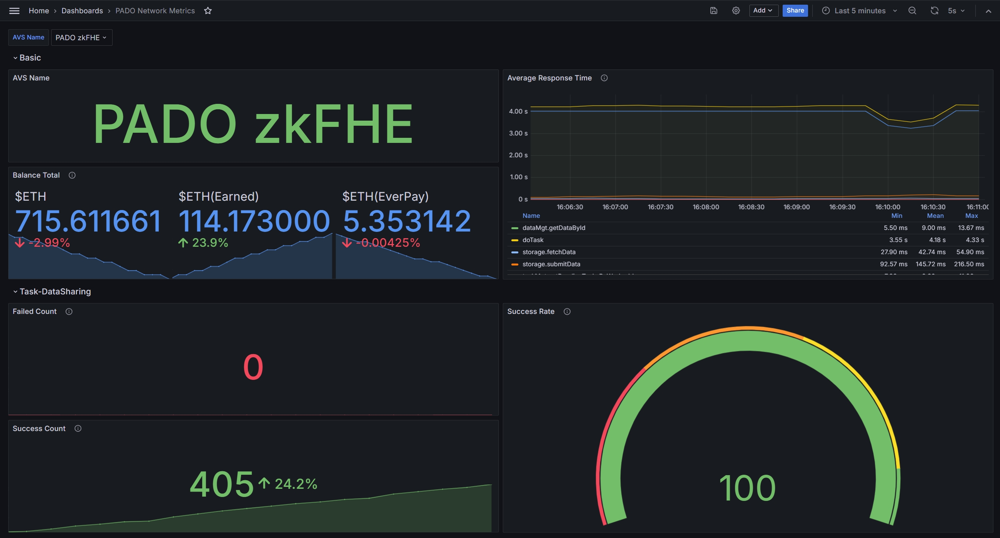

- [Monitoring](#monitoring)
  - [Preparation](#preparation)
  - [Configurations](#configurations)
  - [Usage](#usage)

# Monitoring




## Preparation

Reference [EigenLayer Worker Guide](../pado-node/README-EigenLayerWorker.md) to install docker and start the node.

Switch to the `pado-worker-setup/monitoring` folder.


## Configurations

Config `./prometheus.yml`:

```yaml
  - job_name: "pado-node"
    scrape_interval: 5s
    static_configs:
      # FORMAT container:port
      #   container: pado-node container name
      #        port: NODE_METRICS_PORT
      - targets: ["pado-network:9094"]
```

Note: 
- contrainer: If the node started with a name, such as `bash ./run.sh task somename`, you should update the **container** to `pado-network-somename`. The default value is `pado-network`.
- port: set by `NODE_METRICS_PORT`. The default value is `9094`.


## Usage

- Start

```sh
docker compose up -d
```

You should be able to navigate to `http://host:3000` and login with `admin/admin`. 


- Stop

```sh
docker compose stop
```
